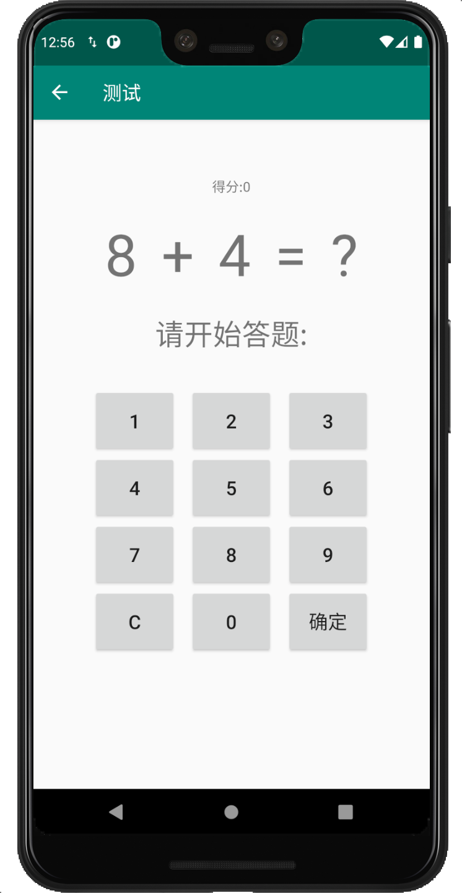
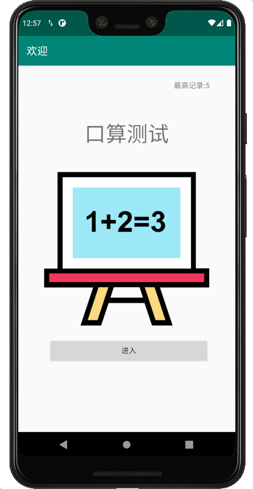
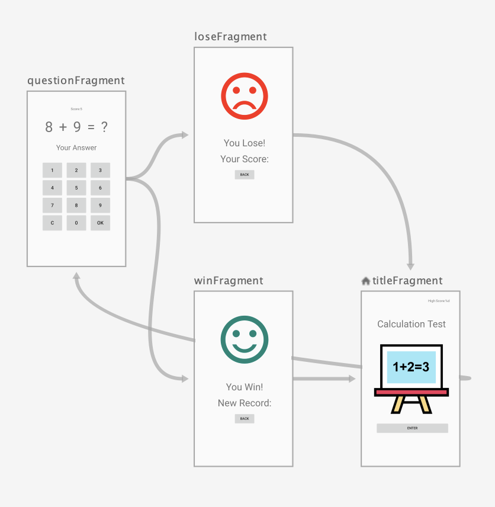

# Calculation_Test: 加减法测试app




<br>

### 结构
MainActivity用来写按下返回键的逻辑  
MyViewModel用来存各种String和LiveData，以及随机生成加减法函数的逻辑  
TitleFragment用来写主页的逻辑  
QuestionFragment用来写计算过程（键盘输入、回答正确、回答错误）的逻辑  
WinFragment用来写win界面的逻辑  
LoseFragment用来写lose界面的逻辑  
layout文件夹下包含activity_main、fragment_title、fragment_question、fragment_win、fragment_lose等等布局  


<br>
<br>

### 细节
#### 1.  创建MyViewModel.java，使用ViewModel构建项目    
SaveStateHandle处理String  
SharedPreferences设置初值  
定义MutableLiveData  
随机生成加法减法的逻辑：  
```
void generator() {
        int LEVEL = 20;
        Random random = new Random();
        int x, y;
        x = random.nextInt(LEVEL) + 1;
        y = random.nextInt(LEVEL) + 1;
        if (x % 2 == 0) {
            getOperator().setValue("+");
            if (x > y) {
                getAnswer().setValue(x);
                getLeftNumber().setValue(y);
                getRightNumber().setValue(x - y);
            } else {
                getAnswer().setValue(y);
                getLeftNumber().setValue(x);
                getRightNumber().setValue(y - x);
            }

        } else {
            getOperator().setValue("-");
            if (x > y) {
                getAnswer().setValue(x - y);
                getLeftNumber().setValue(x);
                getRightNumber().setValue(y);
            } else {
                getAnswer().setValue(y - x);
                getLeftNumber().setValue(y);
                getRightNumber().setValue(x);
            }
        }
    }
```
保存结果的逻辑 save() 函数  
更新结果的逻辑 answerCorrect() 函数 （设置flag）


<br>

#### 2. MainActivity.java 增加Navigation的按下返回键的逻辑

<br>


#### 3.QuestionFragment.java 写键盘输入的逻辑
根据键盘设计类似计算器形式键盘输入的onClickListener  
回答正确的逻辑：  
```
if (Integer.valueOf(builder.toString()).intValue() == myViewModel.getAnswer().getValue()) {
                    myViewModel.answerCorrect();
                    builder.setLength(0);
                    binding.textView9.setText(R.string.answer_corrrect_message);
                    //builder.append(getString(R.string.answer_corrrect_message));
                }
```
回答错误的逻辑： 1.刷新最高分并保存，win界面  2.lose界面  
```
else {
                    NavController controller = Navigation.findNavController(v);
                    if (myViewModel.win_flag) {
                        controller.navigate(R.id.action_questionFragment_to_winFragment);
                        myViewModel.win_flag = false;
                        myViewModel.save();
                    } else {
                        controller.navigate(R.id.action_questionFragment_to_loseFragment);
                    }
                }
```

<br>

#### 4.WinFragment.java 写win界面的逻辑

<br>

#### 5.LoseFragment.java 写lose界面的逻辑

<br>

#### 6.nav.xml的逻辑



